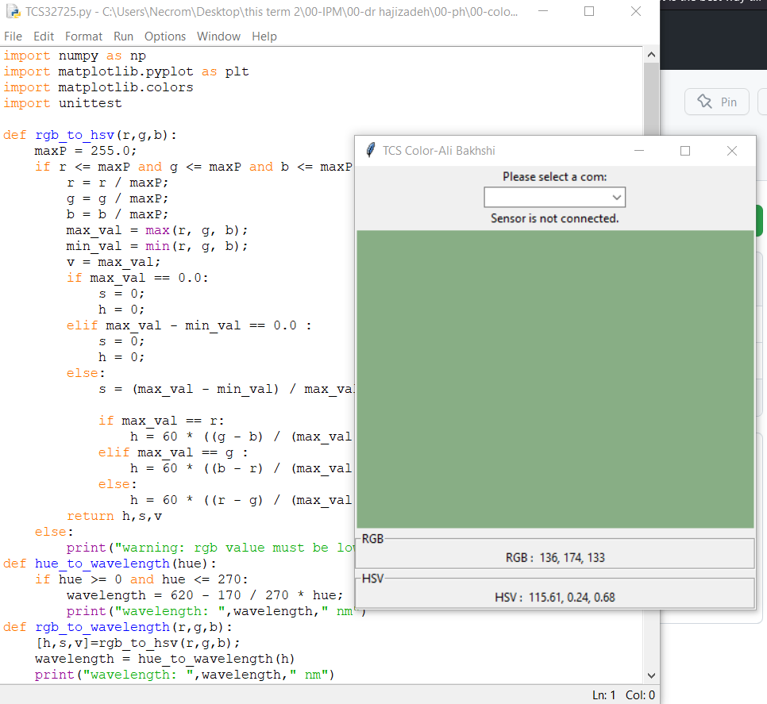

[](https://github.com/bakhshiali)
[](https://github.com/bakhshiali?tab=repositories)
# 🕹️ color meter sensors
  Python tkinter GUI for Pong Game
## 📜 How to run?
### 🧪 Jupyter Lab
  1) install Jupyter lab
  
      Install JupyterLab with pip:
      ```
        pip install jupyterlab
        ```
  2) run Jupyter lab
  
      Once installed, launch JupyterLab windowsshell/terminal with:
      ```
        jupyter-lab
        ```
  3) create "*.ipynb" file & copy the code then paste & run 1st cell
  
### 🐍 Python 

  1) download & install python from [here](https://www.python.org/downloads/)
  2) create new project "*.py" & copy 1st cell of "TCS32725.ipynb" file
  3) run project

## ⤵️ Project GUI dependency
  1) Tkinter : for GUI interface
  
      install with pip in terminal:
      ```
        pip install tk
        ```
      in linux install with sudo:
      ```
        sudo apt-get install python3-tk 
        ```
## ⚙️ features:
  1) Show and select available serial ports
  2) connect the uno/microcontroller to the serial port then print it by selecting the port
  3) try to show the average
  4) RGB and HSV convert
  5) data convertability to temperature/wavelength/...

## 📸 Demo screenshot:

</img>

## 👨‍💻 Author: [Ali Bakhshi](https://github.com/bakhshiali)

## ❓🔔 📧 E-mail: alibakhshi255255@gmail.com
